## I. HTML

- DOCTYPE
- Thẻ html: Đây là thẻ gốc trong tệp dữ liệu và chứa tất cả các loại thẻ khác trong đoạn code (ngoại trừ !DOCTYPE).
- Thẻ head: Phần tử con đầu tiên của thẻ <html> và bao gồm các thẻ con khác chứa thông tin về trang web.
- Thẻ body: Được sử dụng như phần tử con thứ hai của thẻ <html> và dùng để chứa các nội dung mà bạn muốn hiển thị lên trang web.
- Thẻ meta: Thường được đặt bên trong phần tử <head> và dùng để cung cấp metadata cho trình duyệt và công cụ tìm kiếm.
  Những thông tin này thường không hiển thị trên website nhưng các trình duyệt hoặc công cụ tìm kiếm có thể hiểu và đọc được.
- Thẻ title: Thường được sử dụng bên trong thẻ <head> và được dùng để xác định tiêu đề của trang web khi được hiển thị trên trình duyệt.
- 
- Thẻ h: có từ h1 đến h6 để thể hiện mức độ của tiêu đề
- Thẻ br: Được sử dụng để ngắt xuống dòng bởi trong HTML, bạn không thể sử dụng Enter để ngắt xuống dòng như các trình soạn thảo thông thường.
- Thẻ hr: Thường được sử dụng để chèn đường kẻ phân cách nằm ngang và không có thẻ đóng.
- 
- 
- 
- 
- 
- Các thuộc tính của thẻ a:
- 
- 
- 
- 
- Các thuộc tính của thẻ img:
- 
- 
- 
- ./ : Đường dẫn tương đối
- ./ : Trở về thư mục trên 1 cấp
- / : Đường dẫn tuyệt đối
- 
- [HTML Entities](https://www.freeformatter.com/html-entities.html)
- 
- 
- [Codebeautify.org](https://codebeautify.org/html-escape-unescape)
- [PrismJS](https://prismjs.com)
- 
- 
- 
- 
- 
- 
- 
- 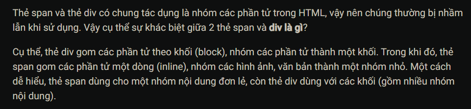

### CTRL + K + C: Comment nhanh trong html

### CTRL + K + U: Uncomment nhanh trong html

### Html tag wrap: Chèn thêm thẻ vào 1 khối sẵn có (ALT + W)

### ALT + SHIFT + Mũi tên (lên) xuống: Copy đoạn bôi đen lên hoặc xuống

### ALT + Mũi tên lên (Xuống): Di chuyển đoạn bôi đen lên hoặc xuống 1 dòng

### ALT + Kích chuột: Sửa trên nhiều dòng

## II. GIT

- VD: git checkout HEAD^
  
  
  
  
  
  
  
  
  
  
  
  
  
  
  
  
  
  
  
  
  
  
  
  
  
  
  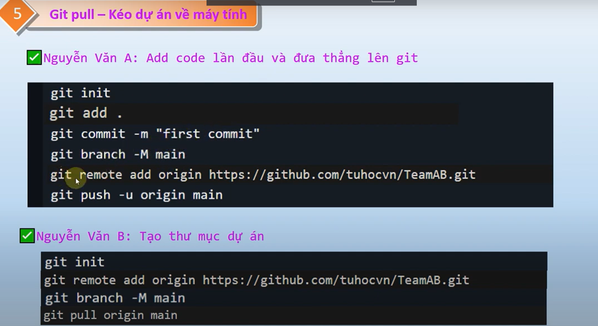

## III. CSS

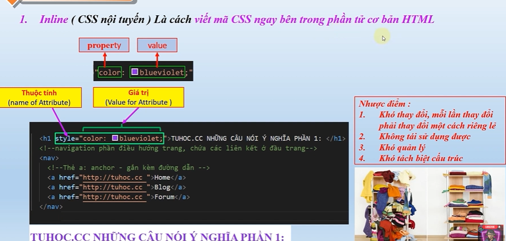
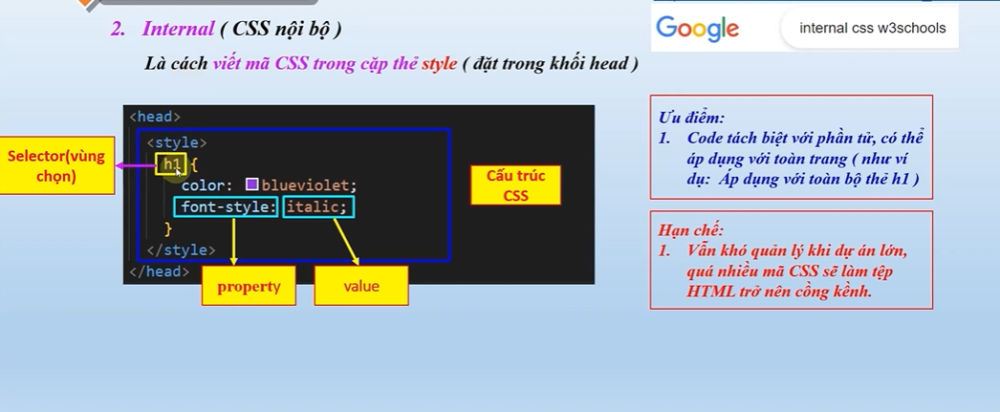

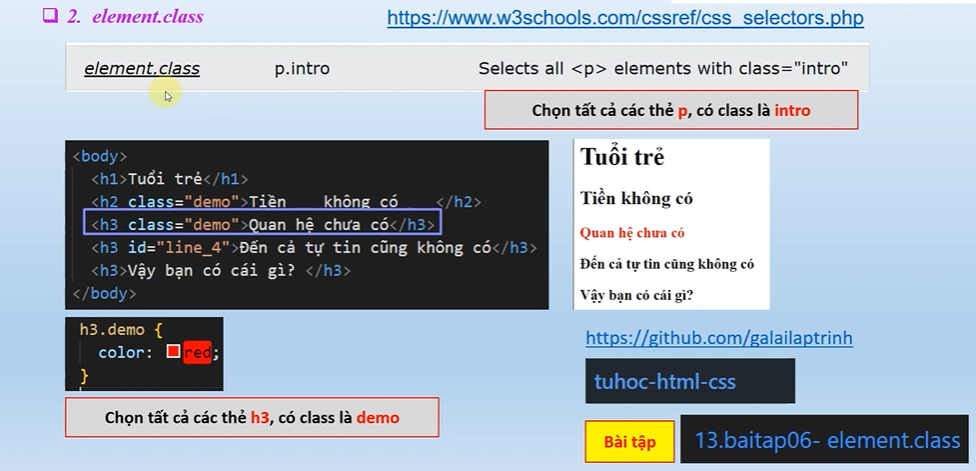

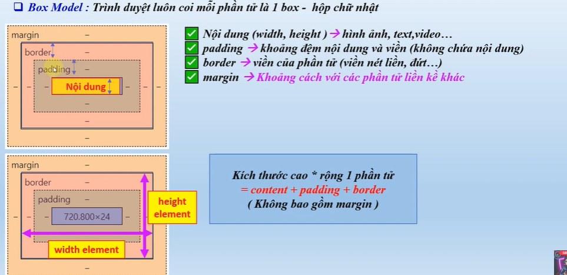

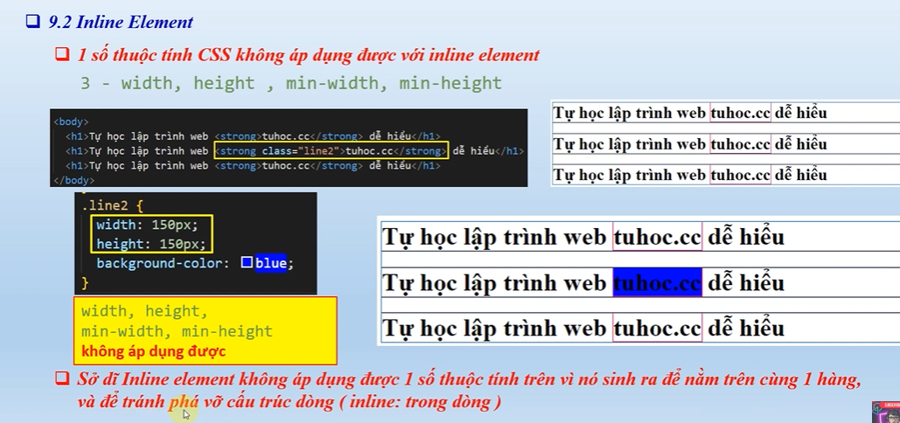

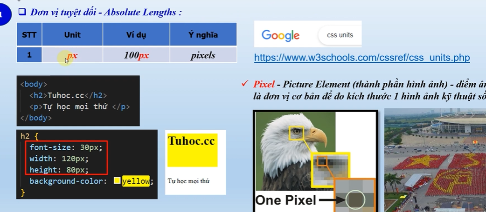

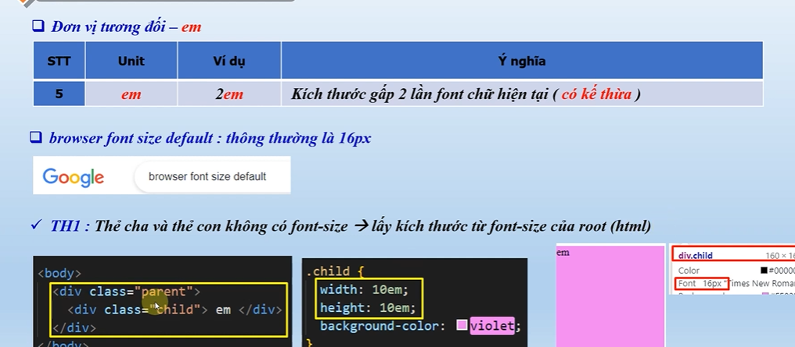

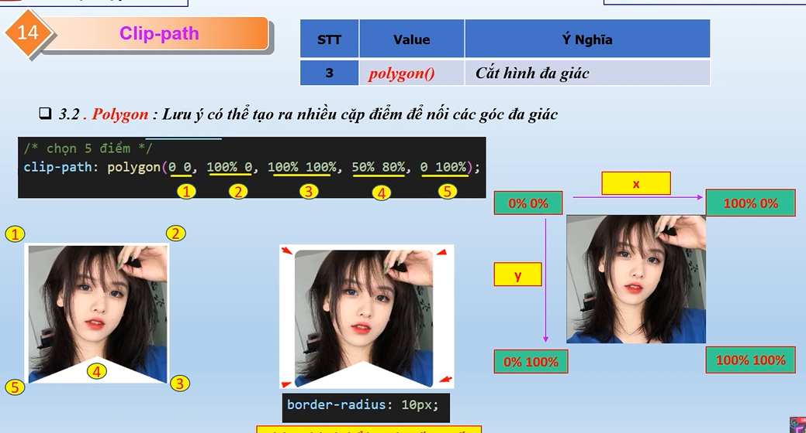

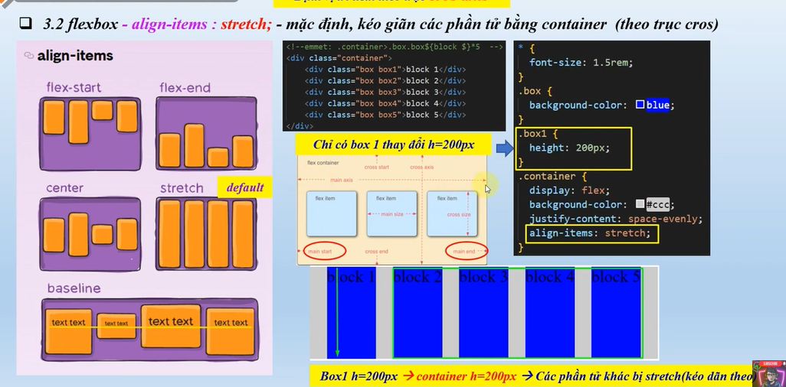

